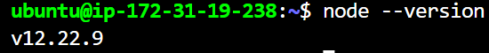
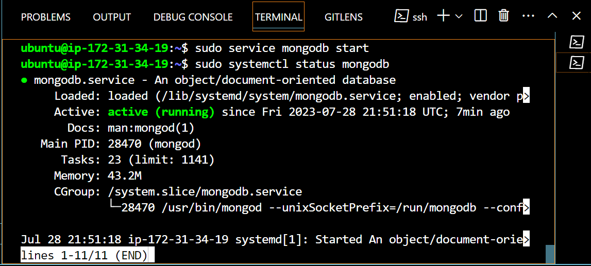
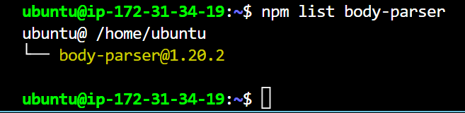
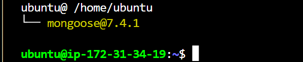

MEAN Stack is a combination of the following components:
1.	MongoDB (Document database) – Stores and allows retrieval of data.
2.	Express (Back-end application framework) – Makes requests to Database for Reads and Writes.
3.	Angular (Front-end application framework) – Handles Client and Server Requests
4.	Node.js (JavaScript runtime environment) – Accepts requests and displays results to end user

Task
This project is aimed at implementing a simple "Book Register Web Form" using MEAN-STACK
***

Node.js installed
```
sudo apt install -y nodejs
```

***

Install MongoDB
MongoDB stores data in flexible, JSON-like documents. Fields in a database can vary from document to document and data structure can be changed over time. For our example application, we are adding book records to MongoDB that contain book name, isbn number, author, and number of pages.
mages/WebConsole.gif
***
```
sudo apt install nodejs -y
```

```
sudo apt install -y mongodb

```
***
Start mongodb server and verify that the service is up and running  
```
sudo service mongodb start
```````
``````
sudo systemctl status mongodb
``````

***
We need ‘body-parser’ package to help us process JSON files passed in requests to the server.

```
sudo npm install body-parser
```


***
NSTALL EXPRESS AND SET UP ROUTES TO THE SERVER

Express is a minimal and flexible Node.js web application framework that provides features for web and mobile applications. We will use Express to pass book information to and from our MongoDB database.
We also will use Mongoose package which provides a straightforward, schema-based solution to model your application data. We will use Mongoose to establish a schema for the database to store data of our book register.

```
sudo npm install express mongoose
```

***

ACCES THE ROUTES WITH ANGULARJS

AngularJS provides a web framework for creating dynamic views in your web applications. In this tutorial, we use AngularJS to connect our web page with Express and perform actions on our book register
***


